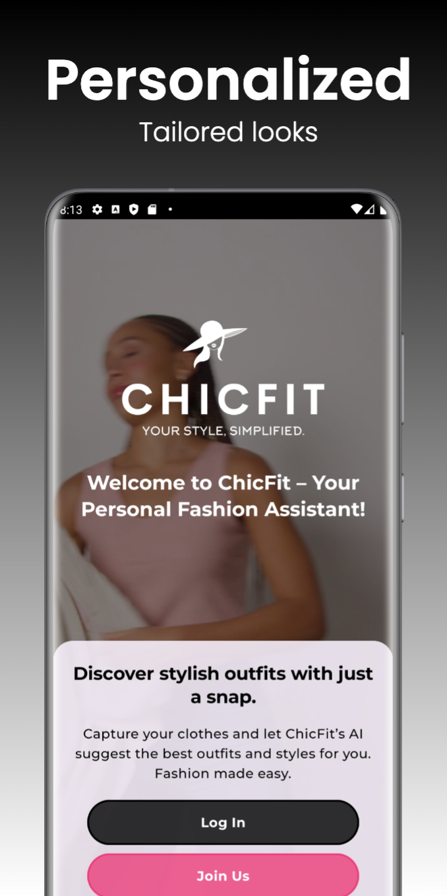
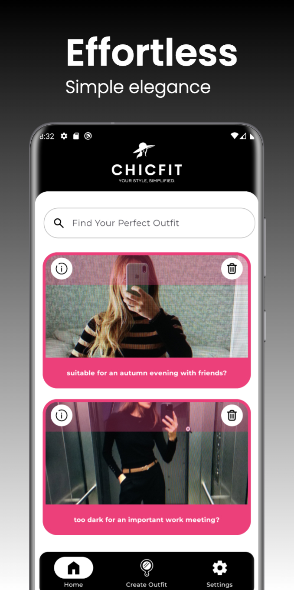
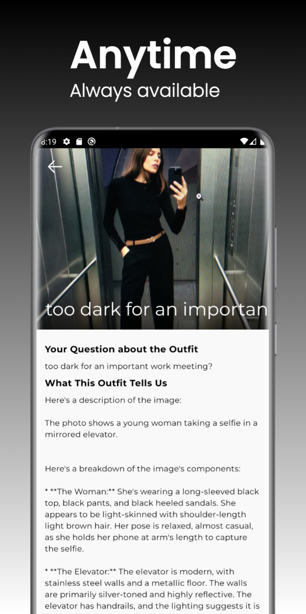
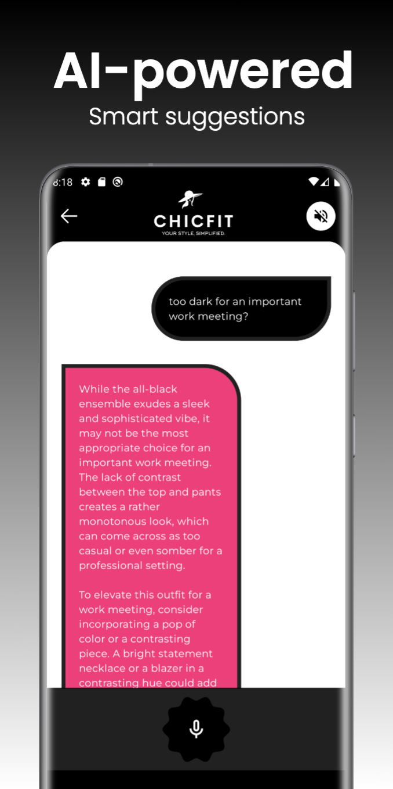
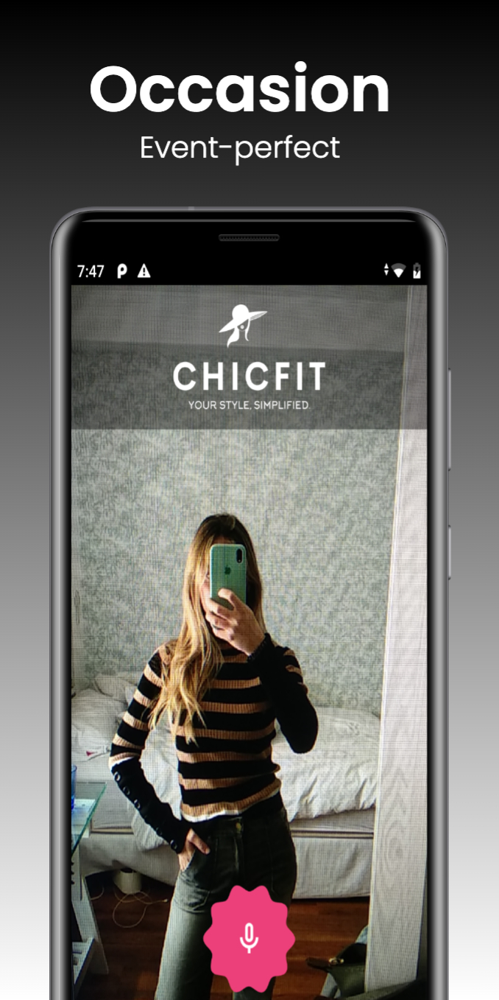

# ChicFit - **Effortless fashion advice tailored just for you.** 👚🌟

ChicFit is a revolutionary mobile application powered by AI, designed to give you personalized fashion advice with just a snap! Capture photos of your clothes and let ChicFit’s advanced AI suggest the perfect outfits, provide style recommendations, and even guide you on whether your clothes are suitable for specific occasions. Whether you're getting ready for a casual day or dressing up for a special event, ChicFit makes your fashion choices smarter and easier than ever.

  
  
  
  
  
  

  
  
  
  
  

## 🚀 Key Features

- **AI-Powered Fashion Advice** 🤖👗: Use ChicFit’s advanced AI to analyze your wardrobe and suggest stylish outfits based on your preferences and current trends.
- **Personalized Outfit Recommendations** 👚👖✨: Capture a photo of your clothes, and ChicFit will suggest the best outfit combinations tailored to your style and preferences.
- **Occasion-Based Suggestions** 🎉👗: Get tailored outfit ideas for different occasions, such as casual days, office wear, or special events.
- **Style Recommendations** 🧥✨: Receive expert fashion tips on how to accessorize and combine colors for a complete and stylish look.
- **Easy Wardrobe Management** 🧳📅: Organize your clothes and outfits and keep track of what’s in your wardrobe.
- **Enhanced User Experience** 🖥️✨: Designed with **Jetpack Compose**, the app delivers a seamless, modern UI with fluid animations and intuitive user flow.

## 🧠 How ChicFit Works

- **Firestore** 🔥📂: Stores personalized outfit suggestions, preferences, and details about your clothes, ensuring that each recommendation is perfectly tailored to you.
- **Firestorage** 🗄️📸: Stores the photos of your clothes, which are analyzed by AI to suggest the best possible combinations and provide style tips.
- **Gemini SDK** 🌟🤖: Powers the AI engine that analyzes images and generates outfit suggestions based on current trends and your personal style.
- **Image Analysis** 📸🔍: Analyzes your wardrobe images to understand the types of clothing and generate meaningful recommendations.

## 🔍 Home Screen Features

- **Outfit Suggestions List** 📄: View all your personalized outfit recommendations. Each suggestion includes details about the clothes and styling tips.
- **Search Functionality** 🔎: Easily search through your wardrobe items to find specific clothes, outfits, or styling tips.
- **Delete Functionality** 🗑️: Manage your wardrobe by deleting or removing unwanted items and suggestions.
- **Detailed View** 👁️: Access the details of each outfit suggestion, where you can adjust your look and finalize your outfit based on the AI recommendations.

## ✨ User Experience Enhancements

- **Optimized Performance** ⚡: Leveraging coroutines ensures smooth operations while processing outfit recommendations and image analysis.
- **Intuitive Navigation** 🧭: The UI, built with **Jetpack Compose**, offers a fluid and responsive experience that adapts to user input.
- **Dynamic Recommendations** 🎯: The combination of the Gemini SDK and MVI architecture ensures that outfit suggestions evolve based on your preferences, making every recommendation more personalized.

## 🛠️ Clean Architecture & MVI for a Robust Foundation

ChicFit is built on **Clean Architecture** principles, ensuring the application is scalable, maintainable, and easy to test. This architecture promotes a clear separation of concerns, with distinct layers for data, domain, and presentation, making it easier to manage and extend.

Using **Model-View-Intent (MVI)** as the UI architectural pattern, ChicFit ensures a reactive and unidirectional data flow that enhances the overall user experience and makes the app more responsive to user actions.

- **Domain-Centric Design** 🧩: The business logic is encapsulated in the domain layer, which interacts with data sources (repositories) and manages the flow of information to and from the UI.
- **Seamless Integration with Gemini SDK** 🤖🌐: The Clean Architecture approach ensures smooth integration with Gemini SDK, enabling fast and accurate image analysis for fashion recommendations.

## 🧰 Technologies Used

- **Kotlin** 💻: The primary programming language for Android development.
- **Jetpack Compose** 🖌️: A modern, declarative UI toolkit that allows for flexible and scalable UI design.
- **Gemini SDK** 🚀🤖: The core AI engine powering the image analysis and fashion recommendations.
- **Firestore** 🔥: Stores personalized outfit suggestions and wardrobe items.
- **Firestorage** 📸: Stores images of clothes that are analyzed by the AI to generate outfit suggestions.
- **Coroutines** ⏱️: Ensures efficient asynchronous task management for a smooth user experience.
- **Hilt/Dagger** 🛠️: Dependency injection frameworks for scalable architecture.
- **Retrofit** 🌐: Manages network communications with external APIs.
- **Coil** 🎨: Image loading library that integrates seamlessly with Jetpack Compose.

## Development with the Brownie UI Library

🍫 **Brownie**: [Jetpack Compose UI Library](https://github.com/sergio11/brownie_ui_library) 🚀

Brownie is a Jetpack Compose UI library that offers a set of pre-defined components to speed up Android app development. It helps developers apply best practices in screen state management and UI design.

### Features 🎉

- **Pre-defined Components**: Brownie provides a variety of ready-to-use components (buttons, lists, cards) to help you design attractive and consistent user interfaces.
- **State Management**: Supports screen state management with MVI or MVVM patterns.
- **Customization**: Highly customizable components that can be adapted to any app's visual style.
- **Jetpack Compose Compatibility**: Fully integrated with Jetpack Compose to ensure optimal performance.

### Model-View-Intent (MVI) Architecture 🏗️

Brownie encourages using MVI for efficient screen state management. In this architecture:

- **Model**: Represents the UI state, with `BrownieViewModel` handling the state.
- **View**: The UI renders based on the state provided by the ViewModel, using Brownie's pre-defined components.
- **Intent**: User actions that trigger state changes, like button clicks or list selections.

For more information, check out the [Brownie UI Library on GitHub](https://github.com/sergio11/brownie_ui_library) and give it a ⭐ if you like it!

## App Screenshots

Here are some screenshots to showcase the app's design and features.
